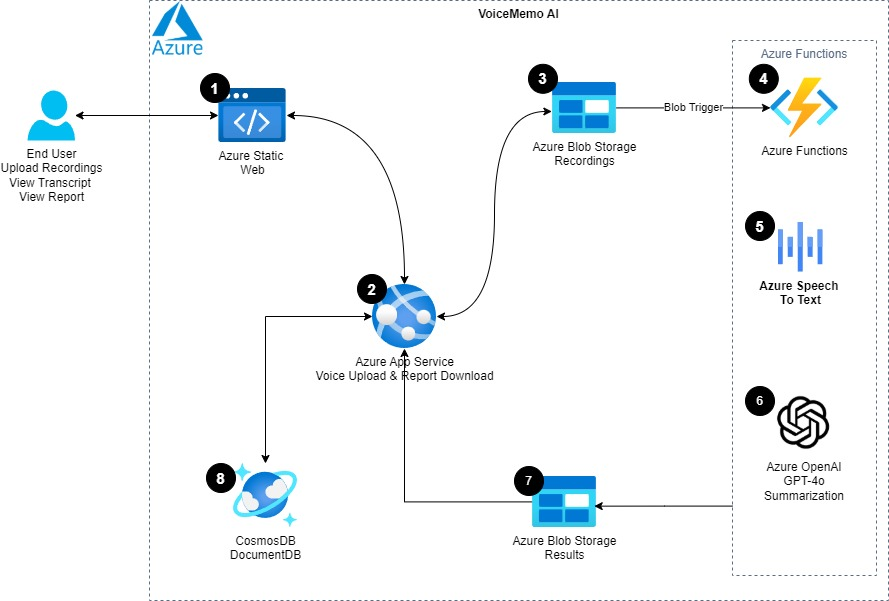
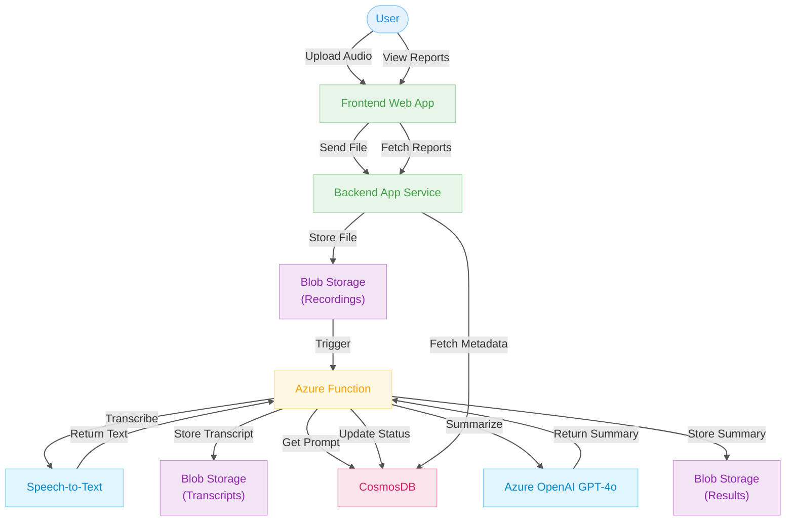

# VoiceMemo AI: Intelligent Voice Summarization System

🇨🇳 [查看中文文档](README.zh.md)  

> ⚠️ This project is under active development and may be subject to changes.

## 📚 Table of Contents

1. [Overview](#overview)
   - [Project Description](#project-description)
   - [Problem Background](#problem-background)
   - [Use Cases](#use-cases)
2. [High-Level Architecture](#high-level-architecture)
3. [Architecture](#architecture)
4. [Components](#components)
5. [Workflow](#workflow)
6. [Prerequisites](#prerequisites)
7. [Deployment](#deployment)
8. [Technologies Used](#technologies-used)
9. [Demo](#demo)
10. [Contributors](#contributors)

---

## 🔍 Overview

### 📌 Project Description

**VoiceMemo AI** is a cloud-native system designed to automate the process of transcribing, summarizing, and generating reports from audio recordings. It delivers an end-to-end pipeline from user input to structured insights, reducing manual effort and operational cost.

### 🎯 Problem Background

Organizations waste a significant portion of time and resources transcribing and summarizing audio manually. In some cases, up to **70% of time** is consumed by these tasks. For instance, call centers and medical institutions struggle with the high cost and complexity of manual processing.

VoiceMemo AI solves these issues by offering an automated, scalable workflow powered by Azure’s cloud and AI services. It transforms unstructured voice data into measurable, actionable insights.

### 💼 Use Cases

```mermaid
flowchart TD
    %% Styling with elegant colors but clearer connections
    classDef user fill:#e3f2fd,stroke:#90caf9,color:#1e88e5,stroke-width:1px
    classDef processor fill:#f3e5f5,stroke:#ce93d8,color:#8e24aa,stroke-width:1px
    classDef reports fill:#fff8e1,stroke:#ffe082,color:#ffa000,stroke-width:1px
    classDef stakeholder fill:#e8f5e9,stroke:#a5d6a7,color:#43a047,stroke-width:1px
    classDef inputs fill:#e1f5fe,stroke:#81d4fa,color:#0288d1,stroke-width:1px
    classDef outputs fill:#fce4ec,stroke:#f48fb1,color:#d81b60,stroke-width:1px
    
    %% Nodes with minimal styling
    User(["User"])
    AudioProcessor["Audio Processor"]
    Reports["Analysis Reports"]
    
    %% Stakeholder nodes
    Management["Management"]
    DecisionMakers["Decision Makers"]
    Compliance["Compliance Teams"]
    Sales["Sales Teams"]
    CustomerService["Customer Service"]
    
    %% Input categories
    MeetingRecordings["Meeting Recordings"]
    CustomerCalls["Customer Calls"]
    FieldNotes["Field Notes"]
    Interviews["Interviews"]
    
    %% Output categories
    ActionItems["Action Items"]
    KeyInsights["Key Insights"]
    Summaries["Meeting Summaries"]
    Analysis["Sentiment Analysis"]
    
    %% Main flow with clearer connections
    User -->|"Upload"| AudioTypes
    
    subgraph AudioTypes["Audio Input Types"]
        MeetingRecordings
        CustomerCalls
        FieldNotes
        Interviews
    end
    
    AudioTypes -->|"Process"| AudioProcessor
    AudioProcessor -->|"Generates"| Reports
    
    Reports --> OutputTypes
    
    subgraph OutputTypes["Report Types"]
        ActionItems
        KeyInsights
        Summaries
        Analysis
    end
    
    OutputTypes -->|"Used by"| Stakeholders
    
    subgraph Stakeholders["Business Stakeholders"]
        Management
        DecisionMakers
        Compliance
        Sales
        CustomerService
    end
    
    %% Apply styles
    class User user
    class AudioProcessor processor
    class Reports reports
    class Management,DecisionMakers,Compliance,Sales,CustomerService stakeholder
    class MeetingRecordings,CustomerCalls,FieldNotes,Interviews inputs
    class ActionItems,KeyInsights,Summaries,Analysis outputs
    
    %% Style subgraphs
    style AudioTypes fill:#fafafa,stroke:#e0e0e0,stroke-width:1px
    style OutputTypes fill:#fafafa,stroke:#e0e0e0,stroke-width:1px
    style Stakeholders fill:#fafafa,stroke:#e0e0e0,stroke-width:1px
    
    %% Make all connection lines darker and more visible
    linkStyle default stroke:#555555,stroke-width:1.5px
```

- 🏥 Medical Appointment Summarization  
- 🏠 Social Worker Session Documentation  
- 📞 Call Center Quality Analysis  
- ⚖️ Legal Proceedings Transcription  
- 🎓 Academic Interview Analysis  
- 💼 Business Meeting Summary Generation

---

## 🏗️ High-Level Architecture

VoiceMemo AI uses the following Azure services:

- **Azure Static Web Apps**: User interface for uploading and viewing reports.
- **Azure App Service**: Backend logic for handling user and audio workflows.
- **Azure Blob Storage**: Stores raw audio, transcripts, and results.
- **Azure Functions**: Event-driven backend for audio processing.
- **Azure Speech-to-Text API**: Transcribes audio recordings.
- **Azure OpenAI GPT-4o**: Generates summaries from transcribed text.
- **CosmosDB (Serverless)**: Stores metadata, prompts, and logs.

---

## 🧱 Architecture

---

## 🧩 Components

1. **Azure Static Web App (Frontend)** – React app for UI and interactions.
2. **Azure App Service (Backend)** – FastAPI service for auth, file ops, and DB access.
3. **Azure Blob Storage** – Stores audio files and processed results.
4. **Azure Functions** – Event-driven transcription and summarization handler.
5. **Azure Speech-to-Text** – Converts speech to raw text.
6. **Azure GPT-4o** – Summarizes the transcription.
7. **CosmosDB** – Tracks job metadata, prompts, and results.

---

## 🔁 Workflow

1. User uploads audio via the web interface.
2. File stored in Blob → triggers Azure Function.
3. Function:
   - Submits transcription → polls for completion.
   - Stores transcribed text in Blob.
   - Retrieves prompt from CosmosDB.
   - Sends to GPT-4o for summarization.
   - Saves result in Blob → updates CosmosDB.
4. Frontend fetches and displays results.

---

## ⚙️ Prerequisites

- Azure subscription with access to:
  - Static Web Apps
  - App Service
  - Blob Storage
  - Functions
  - CosmosDB (Serverless)
  - Speech-to-Text API
  - Azure OpenAI GPT-4o
- Node.js & Python for local dev

---

## 🚀 Deployment

1. Deploy frontend via Azure Static Web Apps.
2. Set up App Service for backend (FastAPI).
3. Configure Blob Storage:
   - `recordings/`
   - `results/`
4. Create Azure Function with Blob Trigger.
5. Integrate Speech-to-Text & GPT-4o APIs.
6. Use CosmosDB to manage metadata and prompts.

---

## 🧪 Demo

> Demo coming soon...

---

## 🛠️ Technologies Used

- **Frontend**: React + Azure Static Web Apps  
- **Backend**: FastAPI + Azure App Service  
- **Storage**: Azure Blob  
- **Processing**: Azure Functions  
- **AI Services**: Azure Speech, OpenAI GPT-4o  
- **Database**: CosmosDB Serverless  

---

## 👥 Contributors

| Name | LinkedIn |
|------|----------|
| Rui Tao | [LinkedIn](https://linkedin.com/in/ruit) |

Feel free to submit a PR if you'd like to contribute!
