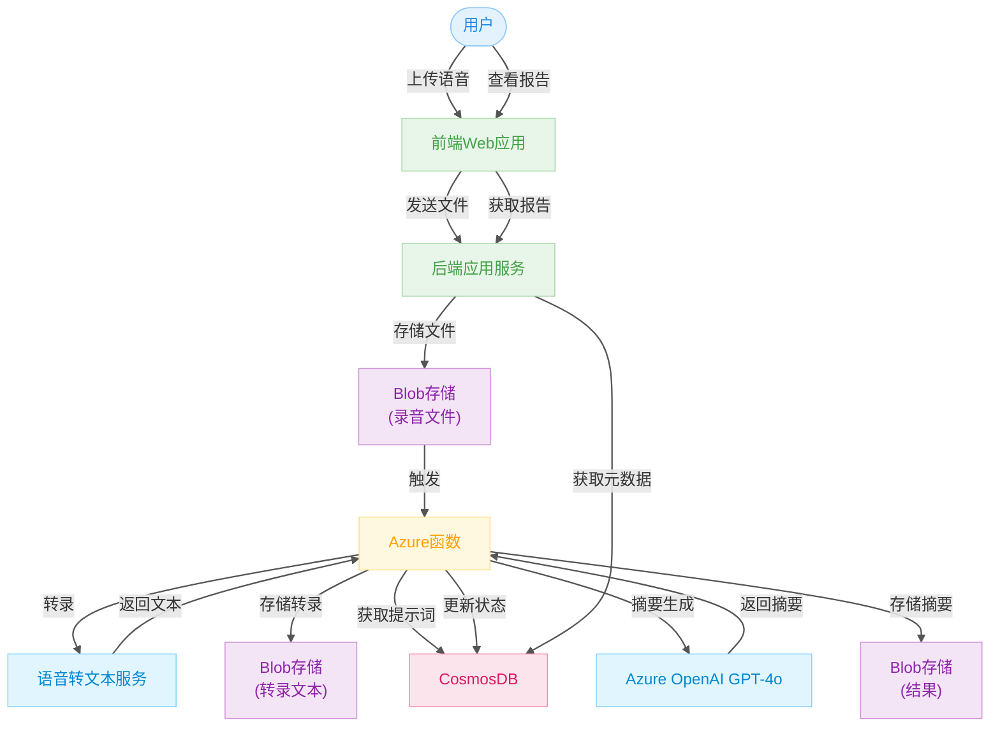

# VoiceMemo AI 智能语音摘要系统

🇺🇸 [View English Version](README.md)

> ⚠️ 本项目仍在积极开发中，未来可能会有调整或更新。

🚀 **在线演示**: [https://voice-memo-ai-phi.vercel.app/](https://voice-memo-ai-phi.vercel.app/)

## 📚 目录

1. [项目概述](#项目概述)  
   - [项目介绍](#项目介绍)  
   - [问题背景](#问题背景)  
   - [应用场景](#应用场景)  
2. [高层架构图](#高层架构图)  
3. [系统架构设计](#系统架构设计)  
4. [系统组件](#系统组件)  
5. [工作流程](#工作流程)  
6. [前置条件](#前置条件)  
7. [部署步骤](#部署步骤)  
8. [使用技术栈](#使用技术栈)  
9. [演示 Demo](#演示-demo)  
10. [贡献者](#贡献者)  

---

## 🔍 项目概述

### 📌 项目介绍

**VoiceMemo AI** 是一个基于云端的智能语音处理系统，支持将用户上传的音频内容自动转写为文本并生成结构化摘要报告，旨在帮助企业和团队提高语音数据处理效率，降低人工成本。

该系统提供完整的端到端流程，从语音输入到结构化输出，适用于医疗、法律、客服、学术研究等多个领域。

---

### 🎯 问题背景

在我们的调研中，许多组织反映在处理语音数据方面面临两个关键问题：

- **人工处理效率低**：最多可占用约 **70% 的工作时间**。
- **资源与成本限制**：包括人力有限、专业工具昂贵、处理延迟等。

VoiceMemo AI 提供了一种基于 Azure 云服务的自动化解决方案，帮助用户将非结构化语音数据转化为可量化、可追踪的结构化信息，提高组织效率。

---

### 💼 应用场景

```mermaid
flowchart TD
    %% 使用典雅的颜色但保持清晰的连接
    classDef user fill:#e3f2fd,stroke:#90caf9,color:#1e88e5,stroke-width:1px
    classDef processor fill:#f3e5f5,stroke:#ce93d8,color:#8e24aa,stroke-width:1px
    classDef reports fill:#fff8e1,stroke:#ffe082,color:#ffa000,stroke-width:1px
    classDef stakeholder fill:#e8f5e9,stroke:#a5d6a7,color:#43a047,stroke-width:1px
    classDef inputs fill:#e1f5fe,stroke:#81d4fa,color:#0288d1,stroke-width:1px
    classDef outputs fill:#fce4ec,stroke:#f48fb1,color:#d81b60,stroke-width:1px
    
    %% 节点定义（中文）
    User(["用户"])
    AudioProcessor["语音处理器"]
    Reports["分析报告"]
    
    %% 利益相关者节点
    Management["管理团队"]
    DecisionMakers["决策者"]
    Compliance["合规团队"]
    Sales["销售团队"]
    CustomerService["客户服务"]
    
    %% 输入类型
    MeetingRecordings["会议录音"]
    CustomerCalls["客户通话"]
    FieldNotes["现场笔记"]
    Interviews["访谈记录"]
    
    %% 输出类型
    ActionItems["行动事项"]
    KeyInsights["关键洞察"]
    Summaries["会议摘要"]
    Analysis["情感分析"]
    
    %% 主要流程（中文标签）
    User -->|"上传"| AudioTypes
    
    subgraph AudioTypes["音频输入类型"]
        MeetingRecordings
        CustomerCalls
        FieldNotes
        Interviews
    end
    
    AudioTypes -->|"处理"| AudioProcessor
    AudioProcessor -->|"生成"| Reports
    
    Reports --> OutputTypes
    
    subgraph OutputTypes["报告类型"]
        ActionItems
        KeyInsights
        Summaries
        Analysis
    end
    
    OutputTypes -->|"使用者"| Stakeholders
    
    subgraph Stakeholders["业务利益相关者"]
        Management
        DecisionMakers
        Compliance
        Sales
        CustomerService
    end
    
    %% 应用样式
    class User user
    class AudioProcessor processor
    class Reports reports
    class Management,DecisionMakers,Compliance,Sales,CustomerService stakeholder
    class MeetingRecordings,CustomerCalls,FieldNotes,Interviews inputs
    class ActionItems,KeyInsights,Summaries,Analysis outputs
    
    %% 子图样式
    style AudioTypes fill:#fafafa,stroke:#e0e0e0,stroke-width:1px
    style OutputTypes fill:#fafafa,stroke:#e0e0e0,stroke-width:1px
    style Stakeholders fill:#fafafa,stroke:#e0e0e0,stroke-width:1px
    
    %% 使连接线更加清晰可见
    linkStyle default stroke:#555555,stroke-width:1.5px
```



- 🏥 医疗会诊记录摘要  
- 🏠 社工面谈记录归档  
- 📞 呼叫中心质检与对话分析  
- ⚖️ 法律会议转写与归档  
- 🎓 学术访谈转录与分析  
- 💼 商务会议纪要自动生成

---

## 🏗️ 高层架构图

VoiceMemo AI 依托以下 Azure 云服务组件构建：

- **Azure Static Web Apps**：前端界面，供用户上传音频和查看报告。
- **Azure App Service**：后端逻辑，处理用户请求、文件上传与数据访问。
- **Azure Blob Storage**：音频文件、转录文本和摘要报告的存储位置。
- **Azure Functions**：监听上传事件，异步触发音频处理流程。
- **Azure Speech-to-Text API**：将音频内容转化为文本。
- **Azure OpenAI GPT-4o**：生成语音内容的结构化摘要。
- **CosmosDB（无服务器）**：用于存储元数据、日志与自定义提示词（prompts）。

---

## 🧱 系统架构设计



---

## 🧩 系统组件

1. **前端（Azure Static Web App）**：基于 React 的用户界面，提供音频上传、报告查看、登录注册等功能。
2. **后端（Azure App Service）**：使用 FastAPI 实现，与前端、Blob 和 CosmosDB 通信。
3. **Blob 存储**：负责存储原始录音、转录结果和摘要文件。
4. **Azure Functions**：基于 Blob 触发，负责处理音频转写和摘要。
5. **语音转文本服务（Azure Speech-to-Text）**：将语音内容转为文本。
6. **GPT-4o 摘要生成器**：基于 OpenAI GPT-4o 的语义摘要能力。
7. **CosmosDB**：存储作业状态、提示词和用户记录等。

---

## 🔁 工作流程

1. 用户通过前端上传语音文件。
2. 后端将文件保存至 Blob 存储并触发函数。
3. Azure Functions 执行以下操作：
   - 提交转写任务 → 等待处理完成。
   - 上传转写结果至 Blob，并更新状态。
   - 从数据库中读取提示词 → 调用 GPT-4o 生成摘要。
   - 存储摘要结果，并更新 CosmosDB 状态。
4. 前端获取并展示结果，用户可在线查看或下载报告。

---

## ⚙️ 前置条件

- 拥有 Microsoft Azure 账户，并开通以下服务权限：
  - Azure Static Web Apps
  - Azure App Service
  - Azure Blob Storage
  - Azure Functions
  - CosmosDB（文档型，无服务器）
  - Azure Speech-to-Text API
  - Azure OpenAI GPT-4o API
- 本地开发环境需安装：
  - Node.js（前端）
  - Python（后端）

---

## 🚀 部署步骤

### Vercel 部署（前端）

1. 准备工作
   - 注册 [GitHub](https://github.com) 账号
   - 注册 [Vercel](https://vercel.com) 账号（可使用 GitHub 账号登录）

2. 从 GitHub 仓库部署
   ```bash
   cd /path/to/your/project
   git init
   git add .
   git commit -m "Initial commit"
   git remote add origin https://github.com/your-username/your-repo-name.git
   git push -u origin main
   ```

3. 通过 Vercel 控制台部署
   - 访问 https://vercel.com 并登录
   - 点击 "Add New Project"
   - 导入你的 GitHub 仓库
   - 配置项目设置：
     - Root Directory: `frontend_app`
     - Framework Preset: Next.js
     - Build Command: `npm run build`
     - Install Command: `npm install --legacy-peer-deps`
     - Output Directory: `.next`
   - 点击 "Deploy"

4. 环境变量配置
   - 在 Vercel 控制台中点击你的项目
   - 进入 "Settings" > "Environment Variables"
   - 添加必要的环境变量（如 API keys 等）

5. 部署完成后：
   - Vercel 会提供一个部署 URL（例如：https://your-project.vercel.app）
   - 你可以在 Vercel 控制台中：
     - 查看部署历史
     - 设置自定义域名
     - 配置环境变量
     - 监控性能

---

## 🛠️ 使用技术栈

- **前端**：React + Azure Static Web Apps  
- **后端**：FastAPI + Azure App Service  
- **存储**：Azure Blob Storage  
- **处理流程**：Azure Functions  
- **AI 能力**：Azure Speech-to-Text + OpenAI GPT-4o  
- **数据库**：CosmosDB（Serverless）

---

## 👥 贡献者

| 姓名 | 联系方式 |
|------|----------|
| Rui Tao | [LinkedIn](https://linkedin.com/in/ruit) |

欢迎感兴趣的小伙伴提交 PR 或参与讨论！

